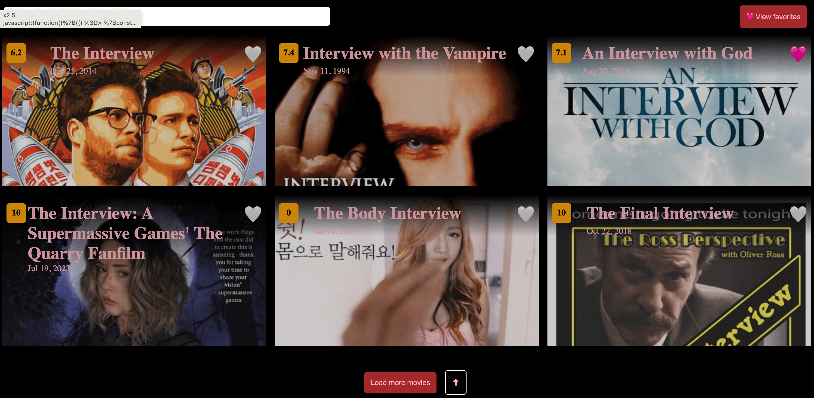
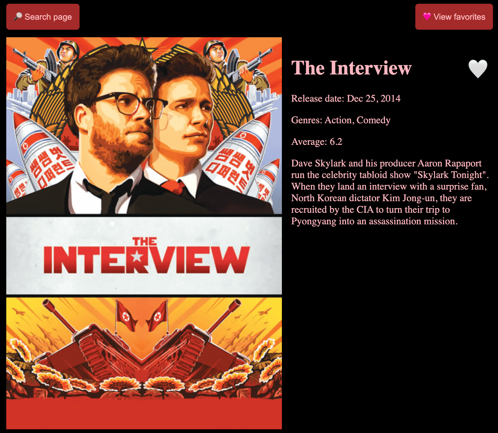
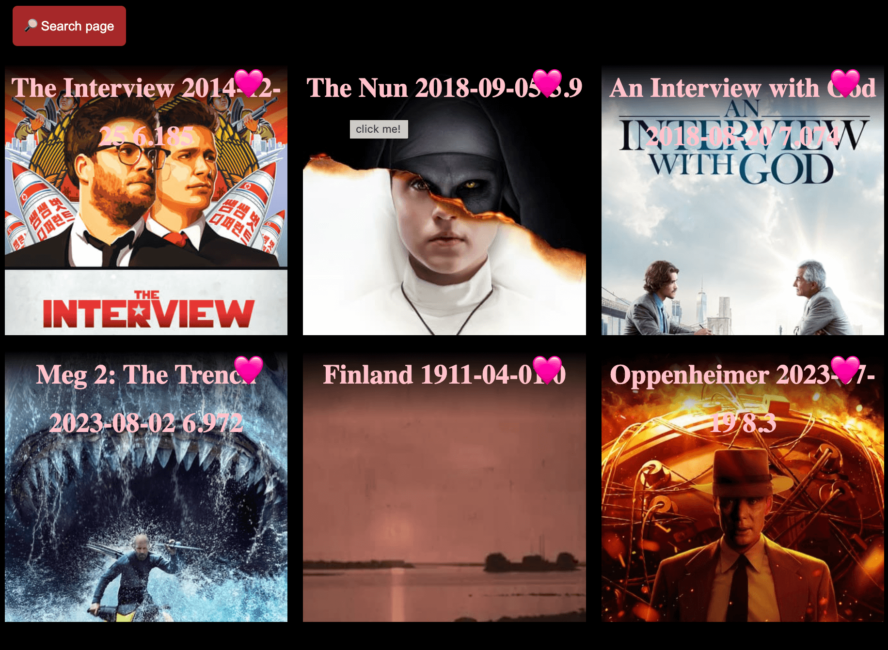

## Overview

[DEMO](https://nghilevi.github.io/movies-search/)

- This project was generated with Angular CLI version 16.
- Tested on: Chrome 112.0.5615.49, Firefox 117.0.1 
- Please see usage notes [here](#notes)

### 1/ Search page


### 1.2/ Search page on small screen size


### 2/ Detail page


### 3/ Favorite page


# Development

Clone the project and run the following commands to see the project on your browser

```bash
npm install
npm run start
```

go to  `http://localhost:4200/`

### Notes
- Click on the heart icon 🤍 to save/unsave movie to favorites collection
- You can access a specific movie detail by manually entering the url e.g http://localhost:4200/movie/1008042
- If you encounter any problems while navigating within the app, such as issues when clicking on the navigation bar buttons, please check the development log for any ChunkLoadError messages. If you come across this error, try clearing your cache and then relaunch the app.