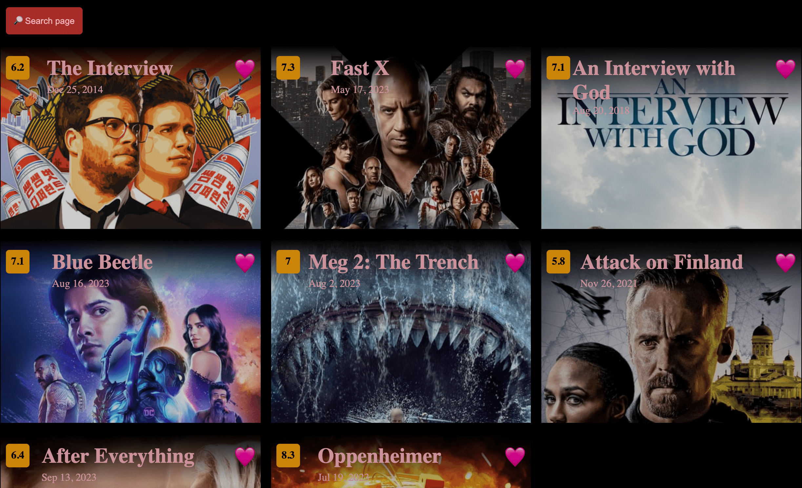

## Overview

- This project was generated with Angular CLI version 16.
- Tested on: Chrome 112.0.5615.49, Firefox 117.0.1 
- Please see usage notes [here](#notes)

### 1/ Search page


### 1.2/ Search page on small screen size


### 2/ Detail page


### 3/ Favorite page


# Development

Clone the project and run the following commands to see the project on your browser

```bash
npm install
npm run start
```

go to  `http://localhost:4200/movies-search`

### Notes
- Click on the heart icon 🤍 to save/unsave movie to favorites collection
- You can access movie detail by manually entering the url e.g http://localhost:4200/movie/1008042
- If you got issues when navigate aronud the app (e.g when click on the navigation bar buttons), check dev log to see if you got ChunkLoadError issue. If that's the case, clear your cache and try to run the app again.